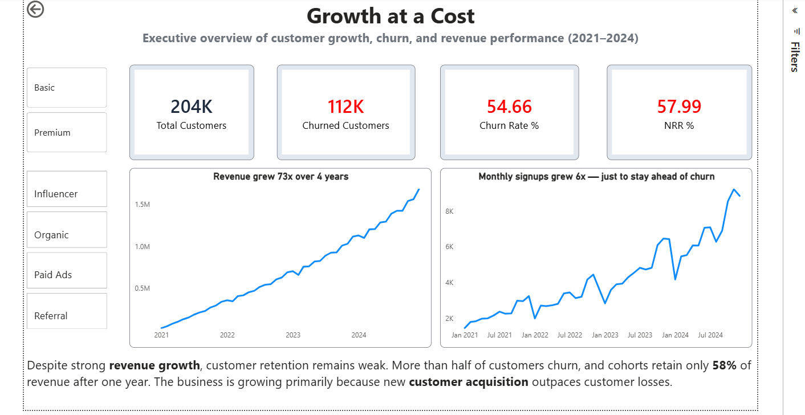
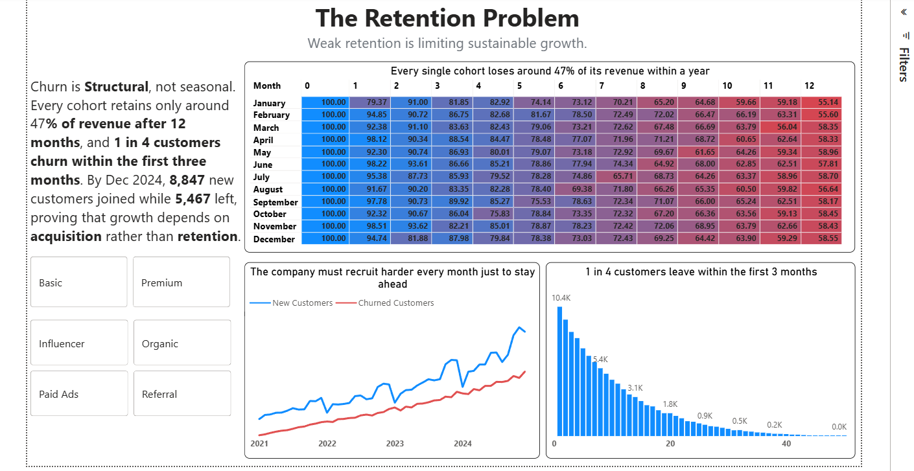
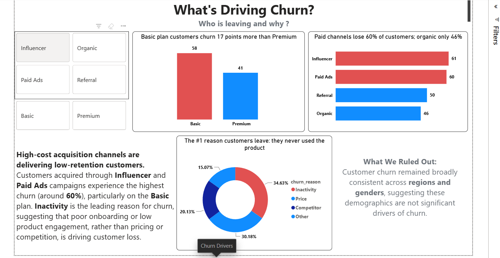
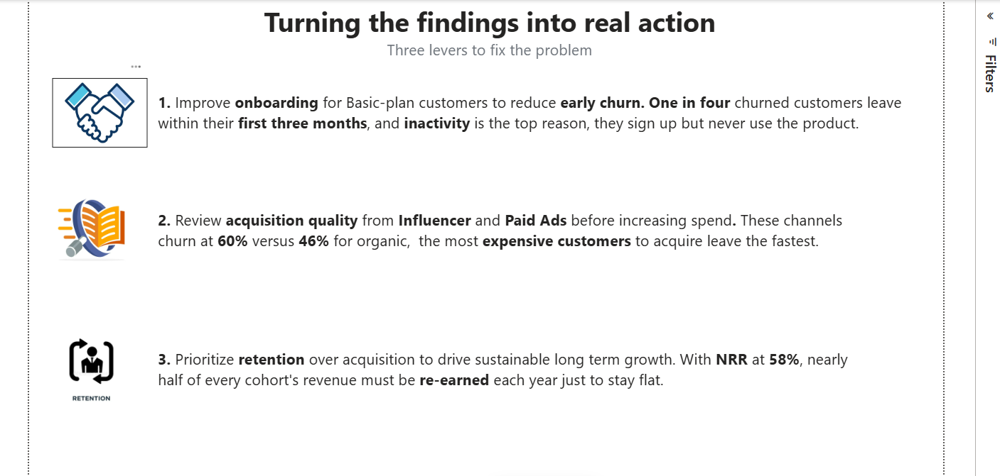

# Customer Churn & Revenue Leak Analysis (2021- 2024)

**The company is growing  but losing over half its customers.**

An end-to-end analytics project investigating why a CRM company's revenue isn't growing as expected despite steady customer acquisition. Built with PostgreSQL, Python, and Power BI.

---

## The Problem

The CEO noticed a puzzle: *"We keep acquiring more customers every month, but revenue isn't growing the way it should."*

New customers aren't the issue, so what is? This project traces the leak: is the existing customer base losing value as fast as new customers are added, where exactly is the leak, and what drives it?

---

## Key Findings

- **55% of customers churn** — the company has lost over half its customer base.
- **Net Revenue Retention is 58%** — every cohort keeps only ~58% of its revenue after 12 months, meaning the base shrinks on its own.
- **Growth is a treadmill** — total revenue rises only because new signups (≈1,500/month growing to ≈9,000/month) outpace those leaving, not because customers are retained.
- **Churn is front-loaded** — 1 in 4 churned customers leave within their first 3 months, and the #1 stated reason is *Inactivity* — they sign up but never use the product.
- **The biggest drivers are plan and channel** — Basic-plan customers churn at 57.6% vs 40.6% for Premium, and customers from paid channels (Influencer 61%, Paid Ads 60%) churn far more than Organic (46%). Region and gender explain nothing.

---

## Dashboard

A 4-page interactive Power BI dashboard tells the story from problem to solution.

| Page | Focus |
|------|-------|
| **1. Executive Summary** | Headline KPIs — churn, NRR, growth |
| **2. Retention Analysis** | Cohort retention heatmap proving the leak is real and systematic |
| **3. Churn Drivers** | Who leaves, why, and when |
| **4. Recommendations** | Three prioritized actions |

*Screenshots are in `/dashboard_screenshots/`.*









Download the power bi file from here - https://drive.google.com/file/d/1K0x2lmWF1x74KesSwD3ScQfith2KT-JE/view?usp=sharing

---

## Recommendations

1. **Improve onboarding for Basic-plan customers to reduce early churn.** One in four churned customers leave within their first three months, and inactivity is the top reason — they sign up but never use the product.

2. **Review acquisition quality from Influencer and Paid Ads before increasing spend.** These channels churn at ~60% versus 46% for Organic, the most expensive customers to acquire leave the fastest.

3. **Prioritize retention over acquisition to drive sustainable growth.** With NRR at 58%, nearly half of every cohort's revenue must be re-earned each year just to stay flat.

---

## Approach

```
CSV data  →  Python (ingest into PostgreSQL)  →  SQL (analysis)  →  Power BI (dashboard)
```

1. **Ingestion (Python):** A reusable script loads raw CSVs into PostgreSQL with logging, per-table error handling, and row-count verification.
2. **Schema (SQL):** Correct data types, primary keys, and foreign keys applied to build a proper relational model.
3. **Analysis (SQL):** Churn rate, MRR trend, Net Revenue Retention (via cohort analysis), and root-cause breakdowns using window functions (`LAG`), CTEs, and cohort logic.
4. **Visualization (Power BI):** DAX measures recreate the SQL logic (NRR cross-validated in both, reconciling at ~58%), feeding an interactive 4-page dashboard.

---

## Tech Used

- **PostgreSQL** — data storage and analysis (window functions, CTEs, cohort analysis)
- **Python** — ETL / ingestion (pandas, SQLAlchemy)
- **Power BI** — interactive dashboard (DAX)

---

## Repository Structure

```
├── README.md
├── ingest.py                  # Python ETL: CSVs → PostgreSQL
├── analysis.sql               # full documented analysis 
├── dashboard_screenshots/     # dashboard page images
    ├── page1_executive.png
    ├── page2_retention.png
    ├── page3_churn_drivers.png
    ├── page4_recommendations.png
└── data/                      # source files
    ├── README.md
```

---

## Data & Assumptions

This project uses a **synthetic dataset**, so the findings demonstrate analytical method and tooling rather than real-world discovery. A few key decisions worth noting:

- **`subscription_history` is a monthly snapshot table** — one row per customer per active month (a customer active for 12 months has 12 rows). This is the spine of the entire analysis.
- **Churn** is defined by `churn_flag = TRUE`, which appears on a customer's final active month.
- **MRR** counts each customer's fee in the month they were active, including their final paid month.
- **NRR / cohort retention** follows each signup group over time, excluding new customers, to isolate how the existing base performs.
- **30-day billing artifact:** Billing runs on 30-day cycles rather than calendar months, so a customer can occasionally have two payments fall in one calendar month. This causes some mid-cohort revenue-retention values to briefly exceed 100% in the heatmap. It is a data artifact, not real growth, the 12-month figure (~58%) is unaffected.
- Only the two tables required for the analysis (`customers`, `subscription_history`) are included here.

---

*Built as a portfolio project to demonstrate an end-to-end analytics workflow: ETL, SQL analysis, and business-focused dashboard design.*
